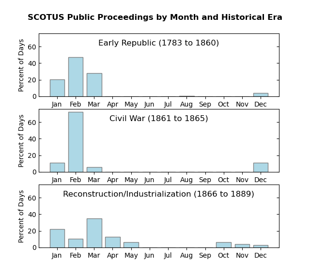

# Work Patterns of the Early U.S. Supreme Court, 1793 to 1889

**A Python Data Analysis Project**

This project examines the productivity patterns of the U.S. Supreme Court during its early formative years (1789 to 1889). Specifically, this analysis seeks to answer three questions about how the work patterns of the early Supreme Court changed over the course of three different eras: the Early Republic (from 1783 to 1860), the Civil War years (1861 to 1856), and the Reconstruction and Industrialization era (1866 to 1899).
1)	How does the pattern of day-to-day work of the Supreme Court vary throughout the early Supreme Court years?
2)	How does the annual court calendar change during the early Supreme Court years?
3)	How does the length of time to deliberate a case change during the early Supreme Court years?

**Data**

The data for this analysis was scraped from the API of Oyez.org, an online multimedia database containing the history of the caseload and judicial personnel of the Supreme Court of the United States (SCOTUS). The Oyez.org API returns a JSON object (see example, [`sample-api-output.json`](sample-api-output.json)). The data were extracted, cleaned, and analyzed using a Python script ([`scotus_norms.py`](scotus_norms.py)) and the matplotlib, pymysql and numpy libraries. 

The Python code can be run from the command line using:

`python scotus_norms.py`

**Results**

See the full [report](Early-SCOTUS-Work-Norms-Analysis.pdf) for details. 

The following figure depicts the most common days of the week that the early Supreme Court either held arguments or decided cases.

The next figure depicts the seasonal trends of the early Supreme Court, estimated using the dates that the Court held arguments or decided cases.

And here we see the minimum, maximum, median, and interquartile range for the number of days from when a case was last argued to when it was decided.

*This project was created for Oregon State University's Data Science Tools and Programming Course, Winter 2025.*
